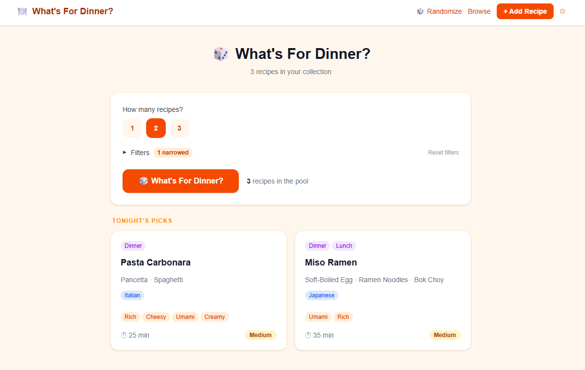

# 🍽️ What's For Dinner?

A personal recipe database and randomizer, built for exactly one household argument: *"I don't know, what do you want?"*

Add the recipes you've cooked (or want to try), tag them however makes sense to you, and let the app pick — with a little flair — so "what's for dinner" stops being a nightly negotiation.



## What it does

- **Recipe database** — store recipes with core components (protein, starch, vegetable), full ingredient lists, and directions, tagged by meal type, cuisine, flavor notes, season, difficulty, and cooking method.
- **Add & edit recipes** — a form-based UI for adding new recipes and editing or deleting existing ones.
- **The randomizer** — pick one recipe at random, or up to three at once, with filters for tags, ingredients, and components. Comes with a proper slot-machine-style reveal, because a plain instant answer felt like it deserved more ceremony.
- **Cook history & ratings** — mark a recipe as cooked, see when you last made it, and give it a quick thumbs up or down so the randomizer can learn what's actually a hit.
- **Backup & restore** — export your whole recipe collection to a file, and merge it back in later without ever risking a duplicate or an accidental wipe.

### On the roadmap

Not built yet, but planned: recipe importing (from a URL or a photo), a "full week" meal-planning mode, a shopping list, dinner party mode (with sides, appetizers, and drinks), and share links.

## Tech stack

- [Next.js](https://nextjs.org/) (App Router, TypeScript)
- [Tailwind CSS](https://tailwindcss.com/)
- [Prisma](https://www.prisma.io/) ORM
- [PostgreSQL](https://www.postgresql.org/) (hosted on [Vercel Postgres](https://vercel.com/storage/postgres) in production)
- Deployed on [Vercel](https://vercel.com/)

## Getting started

### Prerequisites

- Node.js (v18 or later)
- A PostgreSQL database — either a local instance or a free hosted one (e.g. [Vercel Postgres](https://vercel.com/storage/postgres) or [Neon](https://neon.tech/))

### Setup

1. Clone the repo and install dependencies:
   ```bash
   git clone https://github.com/<your-username>/whats-for-dinner.git
   cd whats-for-dinner
   npm install
   ```

2. Copy the example environment file and fill in your own values:
   ```bash
   cp .env.example .env
   ```
   See [Environment variables](#environment-variables) below for what each one does.

3. Apply the database schema and seed a few sample recipes:
   ```bash
   npx prisma migrate dev
   npx tsx prisma/seed.ts
   ```

4. Start the dev server:
   ```bash
   npm run dev
   ```
   Open [http://localhost:3000](http://localhost:3000) and start deciding what's for dinner.

## Environment variables

| Variable | Description |
|---|---|
| `DATABASE_URL` | Postgres connection string. Never commit your real value — see `.env.example` for the expected format. |
| `PASSCODE` | Shared household passcode gating access to the deployed app. Only required in production; feel free to leave unset locally. |

## Scripts

| Command | What it does |
|---|---|
| `npm run dev` | Start the local dev server |
| `npx prisma migrate dev` | Apply schema changes to your database |
| `npx prisma studio` | Open a GUI to browse/edit the database directly |
| `npx tsx prisma/seed.ts` | Seed a few sample recipes (safe — skips if recipes already exist; pass `--force` to wipe and reseed) |

## Deployment

This app is built to deploy cleanly on Vercel with a hosted Postgres database. In short: push to GitHub, import the repo into Vercel, add `DATABASE_URL` and `PASSCODE` as environment variables in the project settings, and deploy.

## Contributing

This started as a personal project (and a first Claude Code build, at that), not a maintained open-source library — but if you've found your way here and have an idea, feel free to open an issue.

## License

[MIT](./LICENSE) — do whatever you'd like with it. If it helps you and your household solve the same nightly argument, that's a win.
